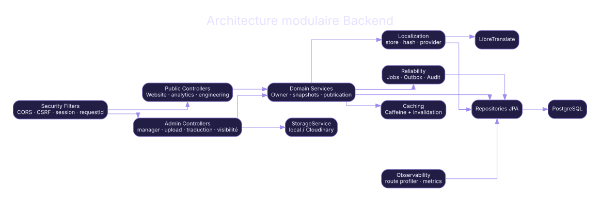
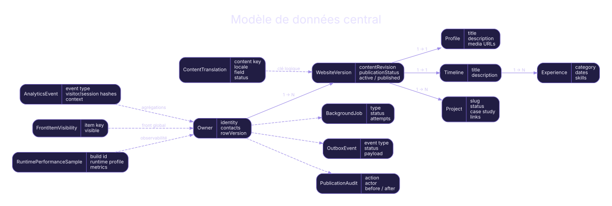
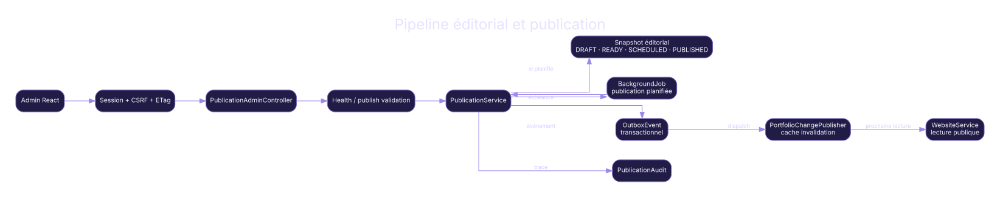
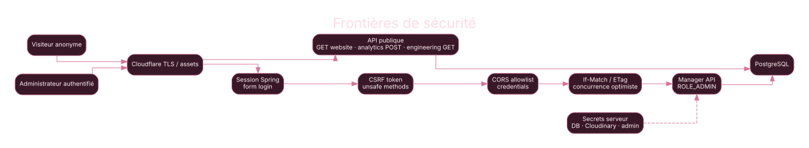
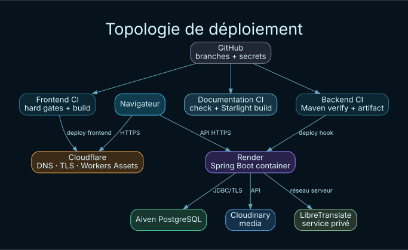

<div align="center">

# Professional Website · Backend

**Spring Boot · PostgreSQL · Flyway · Spring Security · Caffeine · Cloudinary · Actuator**

API publique et administrée, modèle métier, publication, persistence, sécurité, jobs, outbox, traduction, médias, analytics et observabilité.

[Documentation Backend](documentation/src/content/docs/backend/architecture.md) · [Architecture globale](documentation/src/content/docs/overview/system-architecture.md) · [Front ↔ Back](documentation/src/content/docs/integration/front-back.md) · [Cloud](documentation/src/content/docs/cloud/topology.md) · [Déploiement](documentation/src/content/docs/deployment/full-release.md)

</div>

---

## Atlas du système

<p align="center">
  
</p>

Le dépôt backend porte la vérité métier du portfolio. Il expose les lectures publiques, protège l’administration, orchestre l’édition et la publication des snapshots de contenu, persiste les données relationnelles, traite les tâches différées et centralise les intégrations qui nécessitent des secrets serveur.

**Dépôt complémentaire :** [professional_website_front — Frontend React](https://github.com/idris-ach2002/professional_website_front)

---

## Méga-menu technique

| Domaine | Entrée principale | Détails |
|---|---|---|
| **Vue système** | [Vue d’ensemble](documentation/src/content/docs/overview/system-overview.md) | [Architecture](documentation/src/content/docs/overview/system-architecture.md) · [Atlas des diagrammes](documentation/src/content/docs/overview/diagram-atlas.md) · [Carte du dépôt](documentation/src/content/docs/overview/repository-map.md) |
| **Backend** | [Architecture Spring](documentation/src/content/docs/backend/architecture.md) | [Domaine](documentation/src/content/docs/backend/domain-model.md) · [API publique](documentation/src/content/docs/backend/public-api.md) · [API admin](documentation/src/content/docs/backend/admin-api.md) |
| **Métier** | [Publication](documentation/src/content/docs/backend/publication.md) | [Persistence](documentation/src/content/docs/backend/persistence.md) · [Cache](documentation/src/content/docs/backend/cache.md) · [Concurrence](documentation/src/content/docs/backend/concurrency.md) |
| **Fiabilité** | [Jobs / Outbox / Audit](documentation/src/content/docs/backend/jobs-outbox-audit.md) | [Analytics](documentation/src/content/docs/backend/analytics.md) · [Traduction](documentation/src/content/docs/backend/translation.md) · [Storage](documentation/src/content/docs/backend/storage.md) |
| **Intégration** | [Front ↔ Back](documentation/src/content/docs/integration/front-back.md) | [Auth / CSRF / CORS](documentation/src/content/docs/integration/auth-csrf-cors.md) · [Cycle public](documentation/src/content/docs/integration/public-data-lifecycle.md) · [Résilience](documentation/src/content/docs/integration/resilience-cache.md) |
| **Cloud** | [Topologie](documentation/src/content/docs/cloud/topology.md) | [Cloudflare](documentation/src/content/docs/cloud/cloudflare.md) · [Render](documentation/src/content/docs/cloud/render.md) · [Données & médias](documentation/src/content/docs/cloud/data-and-media.md) |
| **Déploiement** | [Release complète](documentation/src/content/docs/deployment/full-release.md) | [Développement local](documentation/src/content/docs/deployment/local-development.md) · [Backend](documentation/src/content/docs/deployment/backend.md) · [Rollback](documentation/src/content/docs/deployment/rollback.md) |
| **Qualité** | [Stratégie de tests](documentation/src/content/docs/quality/testing-strategy.md) | [Tests backend](documentation/src/content/docs/quality/backend-tests.md) · [CI/CD](documentation/src/content/docs/quality/ci-cd.md) · [Contrat documentaire](documentation/src/content/docs/quality/documentation-contract.md) |
| **Sécurité** | [Frontières de confiance](documentation/src/content/docs/security/trust-boundaries.md) | [Sécurité HTTP](documentation/src/content/docs/security/http-security.md) · [SecurityFilterChain](documentation/src/content/docs/backend/security.md) |
| **Exploitation** | [Observabilité](documentation/src/content/docs/operations/observability.md) | [Backend observability](documentation/src/content/docs/backend/observability.md) · [Troubleshooting](documentation/src/content/docs/operations/troubleshooting.md) |
| **Référence** | [Navigation](documentation/src/content/docs/reference/navigation.md) | [Endpoints](documentation/src/content/docs/reference/endpoints.md) · [Environnement](documentation/src/content/docs/reference/environment.md) · [Commandes](documentation/src/content/docs/reference/commands.md) |

---

## Architecture Backend

<p align="center">
  
</p>

Le backend sépare contrôleurs HTTP, services métier, persistence et capacités transversales. Les packages analytics, publication, jobs, events/outbox, translation, upload, visibility et engineering disposent de responsabilités explicites. Spring Security ferme par défaut les routes non classées et les transactions protègent les écritures métier.

### Capacités principales

- **Lecture publique** : assemblage du contenu publié, localisation et cache Caffeine.
- **Administration** : Owner, snapshots éditoriaux, profil, timeline, expériences, projets, visibilité et médias.
- **Publication** : validation, idempotence, planification, rollback éditorial, audit et invalidation de cache.
- **Persistence** : JPA/Hibernate, PostgreSQL, migrations Flyway et concurrence optimiste.
- **Fiabilité asynchrone** : jobs persistés, outbox, retries bornés et récupération des traitements interrompus.
- **Sécurité** : session admin, CSRF, CORS allowlist, validation des redirections et politique `denyAll` par défaut.
- **Observabilité** : Actuator, Prometheus, request ID, route profiler, analytics et Mission Control.

---

## Modèle de données et publication

<p align="center">
  
</p>

Le contenu éditorial est organisé autour d’un `Owner` et de snapshots `WebsiteVersion`. Le snapshot agrège profil, timeline et projets ; des tables spécialisées portent analytics, traductions, visibilité, jobs, outbox, audit de publication et échantillons runtime. `WebsiteVersion` est un concept métier courant du backend : il permet de préparer, prévisualiser et publier un snapshot sans confondre l’état de travail avec l’état public.

<p align="center">
  
</p>

---

## Front ↔ Back et sécurité

<p align="center">
  
</p>

Les routes `/website/**` exposent la lecture publique. L’administration utilise les familles `/manager/**`, `/api/**` administratives et `/uploads/**` derrière une session `ADMIN`. Les mutations de session restent protégées par CSRF ; CORS est construit depuis une allowlist d’origines ; les réponses et erreurs conservent un request ID utile pour la corrélation.

Le détail complet est dans [Front ↔ Back](documentation/src/content/docs/integration/front-back.md) et [Sécurité Backend](documentation/src/content/docs/backend/security.md).

---

## Cloud et déploiement

<p align="center">
  
</p>

Le conteneur Spring Boot est déployé sur Render. PostgreSQL managé fournit la persistence relationnelle, Cloudinary peut servir de provider de stockage média et LibreTranslate reste une intégration côté serveur. Le frontend distribué par Cloudflare appelle l’API en HTTPS. GitHub Actions exécute la qualité, produit l’artifact backend et peut déclencher le déploiement Render via secret de repository.

---

## Site documentaire

La documentation complète est un site **Astro + Starlight** autonome dans `documentation/`. Les diagrammes SVG sont conservés avec leurs sources Graphviz afin de rester maintenables comme du code.

```bash
cd documentation
npm install
npm run check
npm run dev
```

Build documentaire :

```bash
npm run build
npm run preview
```

La CI documentaire est séparée de la CI applicative et ne devient pas une dépendance cachée des tests Spring Boot.

---

## Commandes du dépôt

```bash
./mvnw test
./mvnw clean verify
docker compose up --build
```

Documentation :

```bash
cd documentation
npm install
npm run build
```

Les endpoints, paramètres et opérations quotidiennes sont centralisés dans la section [Référence](documentation/src/content/docs/reference/navigation.md).

---

<div align="center">

**Source de vérité documentaire : branche `main`, code, configuration, migrations et contrats exécutables du dépôt.**

[Ouvrir l’atlas documentaire](documentation/src/content/docs/index.mdx)

</div>
